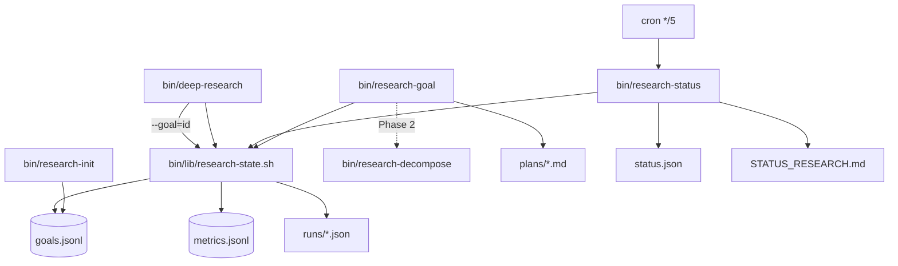

# Plan: Persistent Research-State Layer (Phase 1)

## Goal

Turn `bin/deep-research` from a one-shot tool into a stateful research partner by adding persistent goals, run history, metrics, a live status dashboard, and cron auto-refresh — without changing search provider internals.

## Context

- **Workdir:** `/root/.openclaw/workspace`
- **Zone:** green (workspace + `bin/` + `skills/` + `~/.config/moss/research/`)
- **Yellow/red touch:** crontab append (red per `self-mod-zones.md` — user explicitly requested; merge, do not replace existing entry)
- **Requester channel:** telegram (Alabama, 438805461)
- **Model (execute phase):** `composer-2.5-fast` via grok-build
- **Background:** Exa degraded (401 auth); Serper live. Reliability layer (retry/fallback/cache) already shipped. Nine existing tests PASS via `bin/tests/run-all-tests.sh`.

### Related files (current state)

| File | Role |
|------|------|
| `bin/deep-research` | 406-line orchestrator; `log_event()`, `cost_exceeded()`, `finalize_cost_summary()`; no `--goal` flag yet |
| `bin/cache-research` | SQLite cache at `~/.config/moss/research-cache.sqlite`; `--stats` exposes hit rate |
| `bin/research-decompose` | Stage 1 LLM decompose; requires `OPENROUTER_API_KEY` |
| `bin/lib/retry.sh`, `bin/lib/fallback.sh` | Resilience layer; pattern for shared `bin/lib/` modules |
| `bin/refresh-vps-snapshot` | Cron + tmp-file + `mv` pattern for `STATUS.md` / `STATUS.json` |
| `bin/tests/run-all-tests.sh` | Glob `test-*.sh` — new tests auto-included |
| `skills/deep-research-test/AUTONOMY-ROADMAP.md` | L0→L3 vision; append Phase 2 design only |

### Gaps discovered during planning

1. **No `~/.config/moss/research/` yet** — create via `bin/research-init`.
2. **No shared research-state helpers** — add `bin/lib/research-state.sh` (paths, atomic JSONL, ID gen).
3. **`research-goal list --json` needed** — required by verification script but not listed in subcommands; add it.
4. **`plan` subcommand scope conflict** — requirements mention LLM via `research-decompose`; out-of-scope says stub only for Phase 1. **Resolution:** `plan` writes a structured stub Markdown plan (sets `total_steps` from placeholder steps); full LLM integration deferred to Phase 2.
5. **Run ID format** — `deep-research` uses `YYYYMMDD-HHMMSS` for workdir; research state uses ISO-ish `YYYY-MM-DDTHH-MM-SS` for `runs/` filenames and `goals.runs[]`. Map at record time; keep both in run artifact (`run_id` + `workdir_timestamp`).
6. **Crontab already has VPS refresh** — append research-status line; preserve existing `*/5 * * * * ... refresh-vps-snapshot`.
7. **Tests must isolate state** — `RESEARCH_DIR` env override (mirrors `CACHE_DB` pattern in `test-cache.sh`).

---

## Architecture



### State directory layout

```
~/.config/moss/research/
├── goals.jsonl          # append + atomic line-replace edits
├── metrics.jsonl        # append-only, one JSON per run
├── status.json          # regenerated by research-status
├── runs/
│   └── 2026-06-18T22-35-12.json
└── plans/
    └── g-20260618-001.md
```

Workspace output: `/root/.openclaw/workspace/STATUS_RESEARCH.md`

---

## PR Plan (execution order)

### PR-1: `bin/lib/research-state.sh` — shared state layer

**Create** `bin/lib/research-state.sh` (~180 lines).

#### Constants (overridable for tests)

```bash
RESEARCH_DIR="${RESEARCH_DIR:-${HOME}/.config/moss/research}"
GOALS_FILE="$RESEARCH_DIR/goals.jsonl"
METRICS_FILE="$RESEARCH_DIR/metrics.jsonl"
STATUS_JSON="$RESEARCH_DIR/status.json"
RUNS_DIR="$RESEARCH_DIR/runs"
PLANS_DIR="$RESEARCH_DIR/plans"
WORKSPACE_DIR="${WORKSPACE_DIR:-$(cd "$(dirname "${BASH_SOURCE[0]}")/../.." && pwd)}"
STATUS_MD="$WORKSPACE_DIR/STATUS_RESEARCH.md"
```

#### Functions

| Function | Purpose |
|----------|---------|
| `research_ensure_dirs()` | `mkdir -p` runs/, plans/; `touch` goals.jsonl metrics.jsonl if missing |
| `research_run_id()` | `date -u +%Y-%m-%dT%H-%M-%S` |
| `research_next_goal_id()` | Scan `goals.jsonl` for max `g-YYYYMMDD-NNN` today; increment; pad 3 digits |
| `goals_read_json()` | `jq -s '.' "$GOALS_FILE"` (empty file → `[]`) |
| `goals_append_line(json)` | Append one line to goals.jsonl |
| `goals_update_line(id, jq_expr)` | Read all lines; `jq` transform matching `.id`; atomic `tmp + mv` |
| `goal_get(id)` | Return single goal JSON or exit 1 |
| `metrics_append(json)` | Append to metrics.jsonl |
| `run_write(run_id, json)` | Write `runs/<run_id>.json` via tmp+mv |
| `plan_path_for(id)` | Echo `$PLANS_DIR/<id>.md` |
| `atomic_write(path, content)` | `>.tmp.$$` then `mv` |

#### Goal record factory

```bash
new_goal_record(id, question, priority, tags_json) {
  jq -n \
    --arg id "$id" --arg q "$question" --argjson p "$priority" --argjson tags "$tags_json" \
    --arg now "$(date -u +%Y-%m-%dT%H:%M:%SZ)" \
    --arg plan "$(plan_path_for "$id")" \
    '{id:$id, question:$q, status:"active", priority:$p, tags:$tags,
      created_at:$now, updated_at:$now, notes:[],
      total_steps:0, answered_steps:0, cost_so_far:0.0,
      runs:[], plan_path:$plan}'
}
```

#### Run record helper (called from deep-research)

```bash
record_run_for_goal(goal_id, run_id, artifact_json) {
  # 1. run_write
  # 2. metrics_append (subset fields)
  # 3. goals_update_line: append run_id to .runs[], add cost, bump updated_at
  # 4. optional: increment answered_steps if MARK_STEP set
  # 5. call research-status --quiet (best-effort)
}
```

---

### PR-2: `bin/research-init` — idempotent setup

**Create** `bin/research-init` (~40 lines).

```bash
#!/usr/bin/env bash
set -euo pipefail
source "$(dirname "$0")/lib/research-state.sh"
research_ensure_dirs
# Print created paths; never delete existing data
echo "Research state ready: $RESEARCH_DIR"
ls -la "$RESEARCH_DIR" "$RUNS_DIR" "$PLANS_DIR"
```

- Re-run safe: only creates missing dirs/files.
- Does not overwrite `goals.jsonl` contents.

---

### PR-3: `bin/research-goal` — CRUD on goals

**Create** `bin/research-goal` (~250 lines).

#### Subcommands

| Cmd | Behavior |
|-----|----------|
| `add "question" [--priority=N] [--tags=a,b]` | `research_next_goal_id`; append goal; print id |
| `list [--active\|--done\|--all]` | Pretty table to stdout (default `--active`) |
| `list --json` | JSON array to stdout (for scripts) |
| `show <id>` | Full goal JSON + plan file excerpt + run file list |
| `update <id> [--status=] [--priority=] [--notes=""] [--add-note]` | Patch fields; `--add-note` appends `{ts,text}` to `.notes[]` |
| `done <id> [--notes=""]` | Set `status=done`; optional note |
| `plan <id>` | **Stub (Phase 1):** write `plans/<id>.md` with 3 placeholder step-questions derived from goal text; set `total_steps=3` on goal |
| `--help` | Usage |

#### ID generation (atomic)

```bash
# In research_next_goal_id:
today=$(date -u +%Y%m%d)
max=$(goals_read_json | jq -r --arg d "g-${today}-" '
  [.[] | select(.id | startswith($d)) | .id | split("-")[2] | tonumber] | max // 0')
printf 'g-%s-%03d' "$today" $((max + 1))
```

For concurrent adds: lock via `mkdir "$RESEARCH_DIR/.lock"` or write to `goals.jsonl.tmp.$$` + append with `flock` if available; fallback: temp goals file + mv (read-modify-write whole file for updates; append-only for `add` is naturally atomic per line).

#### `plan` stub output format

```markdown
# Research Plan: {question}
**Goal ID:** {id}
**Generated:** {iso-ts}
**Status:** stub (Phase 2: LLM via bin/research-decompose)

## Steps
### step-1: [pending] Background and context for "{question}"
### step-2: [pending] Key players and current state
### step-3: [pending] Future outlook and implications
```

Update goal: `total_steps: 3`, `plan_path` unchanged.

---

### PR-4: `bin/research-status` — live dashboard

**Create** `bin/research-status` (~220 lines).

#### Modes

| Flag | Behavior |
|------|----------|
| (default) | Write `status.json` + `STATUS_RESEARCH.md` |
| `--json` | Print snapshot JSON to stdout only; no file write |
| `--quiet` | Refresh files; no stdout |

#### Data aggregation

1. **Goals:** load `goals.jsonl`; split active/done; enrich with last run time from `runs/` or `goals.runs[-1]`.
2. **Metrics (7 days):** parse `metrics.jsonl`; filter `timestamp >= now-7d`; sum cost, count runs, avg `latency_s`.
3. **Cache hit rate:** run `bin/cache-research --stats` 2>/dev/null; parse `Hit rate: X%` → `cache_hit_rate: X/100` (0 if no stats).
4. **Recent runs:** last 10 lines of `metrics.jsonl` (or scan `runs/` by mtime).
5. **API health:**
   - `exa`: `bin/exa-search "ping" --type=instant --num=1` with 5s timeout; `ok` / `degraded` / `down`
   - `serper`: `bin/serper-search "ping" --num=1` with 5s timeout; same
   - Use `timeout 5` + exit code; skip if keys missing (mark `unknown`)
   - Map Exa 401 → `degraded` (matches current outage narrative)

#### `status.json` schema

```json
{
  "generated_at": "ISO",
  "active_goals": 0,
  "done_goals": 0,
  "total_cost_week": 0.0,
  "total_runs_week": 0,
  "avg_latency_s": 0,
  "cache_hit_rate": 0.0,
  "last_run": "ISO|null",
  "health": {"exa": "degraded", "serper": "ok"},
  "goals": [...],
  "recent_runs": [...]
}
```

#### `STATUS_RESEARCH.md` generation

- Mirror `bin/refresh-vps-snapshot` pattern: build in temp, `mv` atomically.
- Human-relative times ("2h ago") via python3 one-liner or bash approx.
- Truncate long questions in table to ~40 chars.
- Step progress: `{answered_steps}/{total_steps} steps` or `—` if `total_steps=0`.

---

### PR-5: Integrate `bin/deep-research` with `--goal` / `--mark-step`

**Modify** `bin/deep-research` (~80 lines added).

#### New flags

```bash
GOAL_ID=""
MARK_STEP=""

--goal=*)     GOAL_ID="${1#*=}" ;;
--mark-step=*) MARK_STEP="${1#*=}" ;;
```

Update `--help` with new options.

#### Timing + metrics capture

At top (after TIMESTAMP):

```bash
RUN_ID=$(date -u +%Y-%m-%dT%H-%M-%S)
START_EPOCH=$(date +%s)
STAGES_RUN=0
```

Increment `STAGES_RUN` after each stage block executes (minimum 1 for decompose, +1 search, +1 if DEEP_IDX>0, +1 synth, +1 verify).

#### Sources + verification counts (before finalize)

```bash
sources_found=$(jq -s '[.[] | .results[]? | .url] | unique | length' "$WORKDIR"/exa-*.json "$WORKDIR"/stage3-*.json 2>/dev/null || echo 0)
verification_count=$(echo "$URLS" | wc -w)
summary=$(echo "$REPORT" | head -20 | tr '\n' ' ' | cut -c1-200)
```

#### Post-run hook (end of script, after report written)

```bash
if [ -n "$GOAL_ID" ]; then
  source "$SCRIPT_DIR/lib/research-state.sh"
  DURATION=$(( $(date +%s) - START_EPOCH ))
  ARTIFACT=$(jq -n \
    --arg run_id "$RUN_ID" --arg goal_id "$GOAL_ID" --arg query "$QUERY" \
    --argjson stages "$STAGES_RUN" --argjson cost "$TOTAL_COST" \
    --arg report "$OUTPUT_PATH" --argjson duration "$DURATION" \
    --argjson sources "$sources_found" --argjson verif "$verification_count" \
    --arg summary "$summary" --argjson exceeded "$EXCEEDED" \
    '{run_id, goal_id, question: $query, stages_run: $stages, cost: $cost,
      report_path: $report, duration_s: $duration, sources_found: $sources,
      verification_count: $verif, summary: $summary, budget_exceeded: $exceeded,
      workdir: "'"$WORKDIR"'", timestamp: "'"$(date -u +%Y-%m-%dT%H:%M:%SZ)"'"}')
  record_run_for_goal "$GOAL_ID" "$RUN_ID" "$ARTIFACT"
  if [ -n "$MARK_STEP" ]; then
    goals_update_line "$GOAL_ID" '.answered_steps += 1'
  fi
  "$SCRIPT_DIR/research-status" --quiet 2>/dev/null || true
fi
```

#### Error path

Wrap main pipeline in subshell or use `trap` on EXIT:

```bash
on_exit() {
  local ec=$?
  if [ -n "$GOAL_ID" ] && [ ! -f "$RESEARCH_DIR/runs/$RUN_ID.json" ]; then
    # record failed partial run with status=failed, stages_run so far
  fi
}
trap on_exit EXIT
```

Keep backward compatibility: without `--goal`, zero research-state side effects.

---

### PR-6: Cron — status auto-refresh

**Modify** system crontab (append only).

```cron
# research-status snapshot refresh (added 2026-06-18 by Moss)
*/5 * * * * /root/.openclaw/workspace/bin/research-status --quiet >> /root/.openclaw/workspace/.research-refresh.log 2>&1
```

- Read current crontab with `crontab -l`.
- Skip if line already present.
- Preserve existing `refresh-vps-snapshot` entry.

---

### PR-7: Test coverage

#### 7a. `bin/tests/test-research-goal.sh` (new)

| Case | Assert |
|------|--------|
| Init + add | Returns `g-YYYYMMDD-NNN`; file has 1 line |
| Duplicate day IDs | Two adds → `001`, `002` |
| list / list --json | Active filter works |
| show | Prints question + plan_path |
| update | Priority/status change persists |
| done | status=done |
| plan stub | `plans/<id>.md` exists; `total_steps=3` |

Env: `RESEARCH_DIR="$TMP/research"`.

#### 7b. `bin/tests/test-research-status.sh` (new)

| Case | Assert |
|------|--------|
| Default mode | `status.json` + `STATUS_RESEARCH.md` exist |
| `--json` | Valid JSON on stdout; required keys present |
| Counts | active_goals matches seeded data |
| `--quiet` | No stdout; files updated |

Seed: 2 goals + 1 metrics line via helpers or direct file write.

#### 7c. `bin/tests/test-research-integration.sh` (new)

Reuse `test-deep-research.sh` mock pattern:

1. Copy `deep-research` + `lib/*` + new `lib/research-state.sh` + `research-status` + `research-goal` + `research-init` to `$TESTBIN`.
2. `RESEARCH_DIR="$TMP/research"`; run init + add goal.
3. Run mocked `deep-research "MCP test" --goal=<id> --depth=deep --budget=0.30 --output=$OUT`.
4. Assert:
   - `runs/*.json` exists with `cost`, `stages_run >= 1`
   - `metrics.jsonl` has 1 line
   - `goals.jsonl` updated: `runs[]` non-empty, `cost_so_far > 0` (or >= 0 with mocks)
   - `research-status --quiet` refreshes `status.json`

#### 7d. `bin/tests/run-all-tests.sh`

No change — glob picks up new tests.

#### 7e. `bin/tests/test-deep-research.sh`

No change required if `--goal` is optional; optionally add Test 5 with isolated `RESEARCH_DIR` (nice-to-have, not blocking).

---

### PR-8: Phase 2 design doc (no implementation)

**Modify** `skills/deep-research-test/AUTONOMY-ROADMAP.md` — append section:

```markdown
## Phase 2 design (research-state extensions)

### bin/research-watch
- Cron-driven: pick active goals with unanswered plan steps
- Run bin/deep-research per step; --mark-step=step-N
- Respect budget caps per goal/day

### bin/research-feedback
- --rate=1-5 on reports; append to ~/.config/moss/research-ratings.jsonl

### bin/research-metrics
- Aggregate metrics.jsonl → trends, cost/quality charts data

### research-goal plan (full LLM)
- Call bin/research-decompose; map sub-queries → plan steps
- Set total_steps from array length

### Adaptive prioritization + self-improving prompts
- LLM reviews goals + recent runs; suggests priority changes
- Track query formulations vs verification_pass_rate
```

---

## File manifest

| Action | Path | Est. lines |
|--------|------|------------|
| CREATE | `bin/lib/research-state.sh` | ~180 |
| CREATE | `bin/research-init` | ~40 |
| CREATE | `bin/research-goal` | ~250 |
| CREATE | `bin/research-status` | ~220 |
| MODIFY | `bin/deep-research` | ~80 delta |
| CREATE | `bin/tests/test-research-goal.sh` | ~120 |
| CREATE | `bin/tests/test-research-status.sh` | ~100 |
| CREATE | `bin/tests/test-research-integration.sh` | ~150 |
| MODIFY | `skills/deep-research-test/AUTONOMY-ROADMAP.md` | ~40 append |
| MODIFY | crontab | +2 lines |

**Out of scope (unchanged internals):** `bin/exa-search`, `bin/serper-search`, `bin/exa-contents`, `bin/exa-research`, `bin/research-decompose`.

---

## Verification (execute phase)

```bash
cd /root/.openclaw/workspace

# 1. Syntax check
bash -n bin/lib/research-state.sh
bash -n bin/research-init
bash -n bin/research-goal
bash -n bin/research-status
bash -n bin/deep-research
bash -n bin/tests/*.sh

# 2. Initialize
bin/research-init
ls -la ~/.config/moss/research/

# 3. Goals CRUD smoke
bin/research-goal add "What is the future of x402 payments?" --priority=3
bin/research-goal list

# 4. Status dashboard
bin/research-status
python3 -m json.tool < ~/.config/moss/research/status.json | head -20
head -30 STATUS_RESEARCH.md

# 5. End-to-end with --goal
eval "$(bin/load-secrets)" 2>/dev/null || true
GID=$(bin/research-goal list --json | jq -r '.[0].id')
bin/deep-research "Top MCP server platforms 2026" \
  --goal="$GID" --depth=auto --budget=0.20 \
  --output=/tmp/deep-research-goal-test.md
ls -la ~/.config/moss/research/runs/
tail -1 ~/.config/moss/research/metrics.jsonl | jq .
bin/research-goal show "$GID"

# 6. Cron
crontab -l | grep research-status

# 7. Full suite
bin/tests/run-all-tests.sh
```

**Expected:** all syntax checks pass; all tests PASS (12 total); smoke produces run artifact + metrics line + updated goal; status files regenerated; cron entry present.

---

## Risks & mitigations

| Risk | Mitigation |
|------|------------|
| JSONL concurrent corruption | Atomic `mv` for updates; append-only for add/metrics |
| API health probes burn quota | Minimal `--num=1` ping; 5s timeout; cache stats optional |
| `deep-research` failure before hook | EXIT trap records partial/failed run |
| Crontab is red zone | User explicitly requested; merge-only; log to `.research-refresh.log` |
| `plan` stub vs LLM expectation | Document Phase 2; stub sets 3 placeholder steps |
| `WORKSPACE_DIR` wrong when sourced from lib | Resolve from `BASH_SOURCE` with fallback |
| Integration test flakiness | Mock exa/serper/decompose like existing test-deep-research |

---

## Estimated effort

| PR | Time |
|----|------|
| PR-1 research-state.sh | 45 min |
| PR-2 research-init | 15 min |
| PR-3 research-goal | 60 min |
| PR-4 research-status | 60 min |
| PR-5 deep-research integration | 45 min |
| PR-6 cron | 10 min |
| PR-7 tests | 60 min |
| PR-8 roadmap doc | 15 min |
| Verification + smoke | 20 min |
| **Total** | **~5.5 h** |

---

## Rules (planning phase)

- ✅ PLANNING ONLY complete — this file is the deliverable.
- ❌ No source files modified during planning.
- ⏸ STOP here — await execute approval (ja/kör/ok) before implementation.