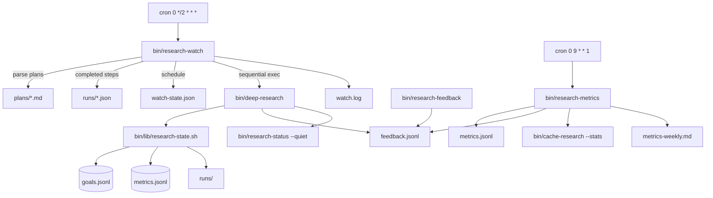

# Plan: Autonomous Research Loop + Feedback/Metrics (Phase 2)

## Goal

Add the autonomous execution loop and feedback/metrics layer to make `bin/deep-research` self-driving: cron finds active goals with unanswered plan-steps, runs deep research for each, logs metrics, accepts user quality ratings, and surfaces trends in a weekly dashboard.

## Context

- **Workdir:** `/root/.openclaw/workspace`
- **Zone:** green (workspace + `bin/` + `skills/` + `~/.config/moss/research/`)
- **Yellow/red touch:** crontab append only (merge; never replace existing entries)
- **Requester channel:** telegram (Alabama, 438805461)
- **Model (execute phase):** `composer-2.5-fast` via `GROK_MODEL=grok-composer-2.5-fast`
- **Background:** Phase 1 deployed and verified — 12 tests PASS via `bin/tests/run-all-tests.sh` (11 non-runner + runner). Crontab has 2 research-related lines (VPS refresh + research-status).

### Phase 1 artifacts (existing)

| File | Role |
|------|------|
| `bin/lib/research-state.sh` | Paths, atomic JSONL, ID-gen, `record_run_for_goal`, metrics append |
| `bin/research-init` | Idempotent dir + files setup |
| `bin/research-goal` | CRUD; `plan` writes 3-step stub (`### step-N: [pending] …`) |
| `bin/research-status` | Live dashboard: `status.json` + `STATUS_RESEARCH.md` |
| `bin/deep-research` | Orchestrator with `--goal`, `--mark-step` (increments counter only; no `step_id` in artifact) |
| `bin/cache-research` | SQLite cache; `--stats` → hit rate |
| `bin/tests/test-research-{goal,status,integration}.sh` | 14 assertions |
| `~/.config/moss/research/` | `goals.jsonl`, `metrics.jsonl`, `runs/`, `plans/` |
| Crontab | `*/5 refresh-vps-snapshot` + `*/5 research-status --quiet` |

### Gaps discovered during planning

1. **Per-step completion tracking missing** — `answered_steps` on goals is an integer counter; run artifacts lack `step_id`. Watch cannot reliably skip completed steps without extending state.
2. **`next_run` scheduling undefined** — no watch-state file or goal field exists yet.
3. **`--due` semantics ambiguity** — spec says skip when `next_run` absent; that would block cron on fresh plan steps. **Resolution:** treat absent `next_run` as **due now**; only skip when `next_run > now`.
4. **Feedback flag naming** — requirements mention both `--feedback-last` and `--feedback=N`. **Resolution:** implement `--feedback=<1-5>` + `--feedback-comment="..."` on `deep-research`; `--feedback-last` is an alias for same-run rating (no separate code path).
5. **Provider attribution for ratings** — `feedback.jsonl` has no provider; derive from run artifact `workdir/cost-summary.json` events at stats time.
6. **Per-stage latency not in metrics** — `metrics.jsonl` has total `latency_s` + `stages_run`. **Resolution:** compute `avg_latency_per_stage = latency_s / stages_run` (guard div-by-zero).
7. **Fallback rate source** — `cost-summary.json` lives in ephemeral `/tmp/deep-research-*` workdirs; run artifact stores `workdir` path. Metrics aggregator reads `workdir/cost-summary.json` when present; count `events[] | select(.event=="fallback")`.
8. **`run-all-tests.sh`** — glob `test-*.sh` already auto-includes new tests; no runner change required.

---

## Architecture



### New state files

```
~/.config/moss/research/
├── feedback.jsonl          # append-only user ratings
├── watch-state.json        # per goal+step next_run scheduling
├── watch.log               # append-only exec log from research-watch
└── metrics-weekly.md       # regenerated by research-metrics (default mode)
```

### `watch-state.json` schema

```json
{
  "g-20260618-001": {
    "step-1": { "next_run": "2026-06-18T22:00:00Z", "last_attempt": "2026-06-18T20:00:00Z", "last_status": "ok" },
    "step-2": { "next_run": null, "last_attempt": null, "last_status": null }
  }
}
```

- On successful run: clear `next_run` (null), set `last_status: ok`.
- On failure: set `next_run = now + 2h` (matches cron interval), `last_status: failed`.
- Absent step entry → due immediately under `--due`.

---

## PR Plan (execution order)

### PR-1: Extend `bin/lib/research-state.sh` — feedback + watch helpers

**Modify** `bin/lib/research-state.sh` (~120 lines added).

#### New constants

```bash
FEEDBACK_FILE="$RESEARCH_DIR/feedback.jsonl"
WATCH_STATE_FILE="$RESEARCH_DIR/watch-state.json"
WATCH_LOG="$RESEARCH_DIR/watch.log"
METRICS_WEEKLY_MD="$RESEARCH_DIR/metrics-weekly.md"
```

#### New functions

| Function | Purpose |
|----------|---------|
| `feedback_append(json)` | Append one line to `feedback.jsonl` |
| `feedback_read_json()` | `jq -s '.'` on feedback file (empty → `[]`) |
| `watch_state_read()` | Load `watch-state.json` or `{}` |
| `watch_state_write(json)` | Atomic write via `atomic_write` |
| `watch_state_set(goal_id, step_id, fields_jq)` | Merge step scheduling entry |
| `watch_log(msg)` | Timestamped append to `watch.log` |
| `plan_parse_steps(plan_path)` | Emit JSON array `[{id, question, status}]` via bash+jq |
| `goal_completed_step_ids(goal_id)` | Scan `runs/*.json` for matching `goal_id` + non-null `step_id` |
| `run_dominant_provider(run_json)` | Read `workdir/cost-summary.json`; return `exa`, `serper-fallback`, or `unknown` |

#### Extend `research_ensure_dirs`

Touch `feedback.jsonl`; create empty `watch-state.json` as `{}` if missing.

#### Extend `record_run_for_goal` caller contract

Document that artifact may include optional `step_id` field (added in PR-5).

---

### PR-2: `bin/research-watch` — autonomous execution loop

**Create** `bin/research-watch` (~280 lines).

#### CLI

| Flag | Behavior |
|------|----------|
| `--all` | Include all pending steps (ignore `next_run`) |
| `--due` | Only steps where `next_run` is null/absent OR `next_run <= now` |
| `--exec` | Actually invoke deep-research (without: dry-run list only) |
| `--goal=<id>` | Restrict to one goal |
| `--help` | Usage |

Default (no flags): same as `--all` dry-run (list pending).

`DEEP_RESEARCH_BIN="${DEEP_RESEARCH_BIN:-$SCRIPT_DIR/deep-research}"` for test mocking.

#### Plan parsing (`plan_parse_steps`)

Heuristic parser for `plans/<id>.md`:

1. **Primary (Phase 1 stub):** `^### (step-[0-9]+): \[(pending|done)\] (.+)$` → id, status, question text.
2. **Checkbox:** `^- \[ \] (.+)$` under `## Steps` → auto-id `step-N` by order.
3. **Heading:** `^## Step ([0-9]+): (.+)$` → id `step-N`, question from remainder.
4. **Numbered list:** `^[0-9]+\. (.+)$` under `## Steps` section.

Emit compact JSON per step: `{goal_id, step_id, question}`.

#### Pending step detection

For each active goal (`status == active`) with existing plan file:

```bash
completed=$(goal_completed_step_ids "$goal_id")  # from run artifacts' step_id
pending = plan_steps | select(.step_id not in completed)
```

Do **not** rely solely on `answered_steps` counter (can drift if steps run out of order).

#### Due filter

```bash
if [ "$DUE_ONLY" -eq 1 ]; then
  next_run=$(watch_state[goal][step].next_run // null)
  if [ -n "$next_run" ] && [ "$next_run" \> "$(date -u +%Y-%m-%dT%H:%M:%SZ)" ]; then
    skip
  fi
fi
```

#### Execution (`--exec`)

Sequential loop (no parallel):

```bash
bin/deep-research "$question" \
  --goal="$goal_id" \
  --mark-step="$step_id" \
  --depth=auto \
  --budget=0.20 \
  --output="/tmp/deep-research-auto-${ts}.md"
```

- Capture exit code; on success read latest `runs/<run_id>.json` for cost/stages/sources.
- On failure: log to `watch.log`, set `next_run = now+2h`, continue.
- On success: update watch-state, `research-status --quiet`.
- Track `FAILURES` counter; exit 1 if any failed, else 0.

#### Output format

Match spec example (header with UTC timestamp, pending list, per-run ✓/✗ lines with cost/stages/sources or error snippet).

---

### PR-3: `bin/research-feedback` — quality ratings

**Create** `bin/research-feedback` (~200 lines).

#### Subcommands / forms

| Invocation | Behavior |
|------------|----------|
| `bin/research-feedback <run-id> --rating=1-5 [--comment="..."]` | Standalone rating |
| `bin/research-feedback list [--limit=20]` | Recent ratings table |
| `bin/research-feedback stats` | Avg rating per goal + per provider |
| `--help` | Usage |

#### Validation

- Rating must be integer 1–5.
- Resolve `goal_id` from `runs/<run-id>.json` if exists; else `"standalone"`.
- Resolve `provider` at write time via `run_dominant_provider` (best-effort; may be `unknown`).

#### Storage (`feedback.jsonl`)

```json
{
  "run_id": "2026-06-18T22-39-15",
  "goal_id": "g-20260618-001",
  "rating": 4,
  "comment": "good sources but missing recent data",
  "provider": "exa",
  "ts": "2026-06-18T23:15:00Z"
}
```

#### `stats` output

- Per goal: count, avg rating.
- Per provider (`exa`, `serper-fallback`, `unknown`): count, avg rating.
- Join feedback → run artifact for provider when `provider` field missing in older entries.

---

### PR-4: `bin/research-metrics` — weekly dashboard

**Create** `bin/research-metrics` (~320 lines).

#### CLI

| Flag | Behavior |
|------|----------|
| (default) | Write `metrics-weekly.md` |
| `--json` | Print JSON snapshot to stdout |
| `--period=7d\|30d\|24h` | Filter window (default `7d`) |
| `--help` | Usage |

#### Period parsing

Reuse TTL-style parser from `cache-research` pattern (`24h`, `7d`, `30d` → cutoff ISO timestamp).

#### Aggregations

From filtered `metrics.jsonl`:

| Metric | Computation |
|--------|-------------|
| Total runs | count |
| Total cost | sum `.cost` |
| Success rate | `count(status=="ok") / total` |
| Avg latency per stage | `avg(latency_s / max(stages_run,1))` |
| Top goals by cost | group by `goal_id`, sort desc, top 5 |
| Top goals by runs | group by `goal_id`, sort desc, top 5 |
| Cost trend | bucket by UTC date; ASCII sparkline (`▁▂▃▄▅▆▇`) or markdown table |

From `feedback.jsonl` (same period):

| Metric | Computation |
|--------|-------------|
| Avg rating overall | mean `.rating` |
| Avg rating per provider | group by `.provider` |

From `bin/cache-research --stats`:

| Metric | Computation |
|--------|-------------|
| Cache hit rate | parse `Hit rate: X%` |

From run artifacts (`runs/*.json` → `workdir/cost-summary.json`):

| Metric | Computation |
|--------|-------------|
| Exa vs Serper fallback rate | runs with ≥1 fallback event / total runs with readable workdir |

#### `metrics-weekly.md` sections

```markdown
# Research Metrics — 7d ending 2026-06-18 23:00 UTC

## Summary
- Runs: N | Cost: $X.XX | Success: Y% | Avg rating: Z.Z

## Cost trend
| Date | Runs | Cost |
...

## Providers
- Exa-primary runs: …
- Serper fallback events: …%

## Top goals
...

## Feedback
...
```

---

### PR-5: Extend `bin/deep-research` — step_id + feedback flags

**Modify** `bin/deep-research` (~50 lines added).

#### New flags

```bash
FEEDBACK_RATING=""
FEEDBACK_COMMENT=""

--feedback=*)          FEEDBACK_RATING="${1#*=}" ;;      # 1-5
--feedback-comment=*) FEEDBACK_COMMENT="${1#*=}" ;;
--feedback-last)      ;;  # alias/no-op marker; use with --feedback=N
```

Update `--help`.

#### Artifact extension

Add to run artifact JSON:

```json
"step_id": "<MARK_STEP or null>"
```

#### Post-run feedback hook

After successful `record_run_for_goal`, if `FEEDBACK_RATING` set:

- Require `--goal` (exit 1 if `--feedback` without goal per spec).
- Call `feedback_append` with `run_id`, `goal_id`, `rating`, `comment`, `provider`, `ts`.

#### Mark-step improvement

When `MARK_STEP` set:

1. Include `step_id` in artifact.
2. Increment `answered_steps` (keep existing behavior).
3. Optionally append to `answered_step_ids[]` on goal if array added — **prefer run-artifact scan** to avoid goal schema migration.

---

### PR-6: Cron — watch + weekly metrics

**Modify** crontab (append only; skip if line exists).

```cron
# research-watch — every 2 hours, run due step-questions
0 */2 * * * /root/.openclaw/workspace/bin/research-watch --due --exec >> /root/.openclaw/workspace/.research-watch.log 2>&1

# research-metrics weekly — every Monday 9am UTC
0 9 * * 1 /root/.openclaw/workspace/bin/research-metrics >> /root/.openclaw/workspace/.research-metrics.log 2>&1
```

Implementation script:

```bash
(crontab -l 2>/dev/null; printf '%s\n' '...') | crontab -
```

Preserve existing 2 lines → total 4.

---

### PR-7: Test coverage

#### 7a. `bin/tests/test-research-watch.sh` (new)

| Case | Assert |
|------|--------|
| Seed goal + plan stub | 3 pending steps listed |
| `--all` dry-run | Lists steps; does not call deep-research |
| `--exec` with mock DR | Mock script invoked once per pending step with correct `--goal`, `--mark-step`, query |
| Completed step excluded | Pre-seed run artifact with `step_id: step-1`; only 2 invocations |
| `--due` skip future | watch-state `next_run` far future → step skipped |
| `--due` include overdue | `next_run` past → step included |
| Failure handling | Mock returns exit 1; watch exits 1; continues to next step; `watch.log` has entry |
| `--goal=` filter | Only steps for that goal |

Mock `DEEP_RESEARCH_BIN` writes minimal run artifact + exits 0.

#### 7b. `bin/tests/test-research-feedback.sh` (new)

| Case | Assert |
|------|--------|
| Submit rating | Line in `feedback.jsonl`; valid JSON; rating 1–5 |
| Unknown run-id | `goal_id=standalone` |
| Known run-id | `goal_id` from artifact |
| `list` | Shows submitted entry |
| `stats` | Computes avg for goal |
| Invalid rating | Exit non-zero |

#### 7c. `bin/tests/test-research-metrics.sh` (new)

| Case | Assert |
|------|--------|
| Seed metrics + feedback | 5+ lines across 2 goals |
| Default markdown | `metrics-weekly.md` created with Summary section |
| `--json` | Valid JSON; `total_runs`, `total_cost`, `success_rate` correct |
| `--period=24h` | Older entries excluded |
| Sparkline/table | At least one date bucket present |

#### 7d. Extend `bin/tests/test-research-integration.sh` (optional small add)

| Case | Assert |
|------|--------|
| `--mark-step=step-1` | Run artifact contains `step_id: step-1` |
| `--feedback=4` | Line appended to `feedback.jsonl` |

#### 7e. `bin/tests/run-all-tests.sh`

No change — glob picks up 3 new tests (15 total).

---

## File manifest

| Action | Path | Est. lines |
|--------|------|------------|
| MODIFY | `bin/lib/research-state.sh` | +120 |
| CREATE | `bin/research-watch` | ~280 |
| CREATE | `bin/research-feedback` | ~200 |
| CREATE | `bin/research-metrics` | ~320 |
| MODIFY | `bin/deep-research` | +50 |
| CREATE | `bin/tests/test-research-watch.sh` | ~180 |
| CREATE | `bin/tests/test-research-feedback.sh` | ~120 |
| CREATE | `bin/tests/test-research-metrics.sh` | ~150 |
| MODIFY | `bin/tests/test-research-integration.sh` | +30 |
| MODIFY | crontab | +2 lines |

**Out of scope (unchanged):** `bin/exa-search`, `bin/serper-search`, `bin/research-decompose`, Telegram alerts, LLM plan generation, adaptive prioritization.

---

## Verification (execute phase)

```bash
cd /root/.openclaw/workspace

# 1. Syntax check
bash -n bin/lib/research-state.sh
bash -n bin/research-watch
bash -n bin/research-feedback
bash -n bin/research-metrics
bash -n bin/deep-research
bash -n bin/tests/*.sh

# 2. Initialize + goal with plan
bin/research-init
bin/research-goal add "Test watch feedback" --priority=2 || true
GOAL_ID=$(bin/research-goal list --json | python3 -c "import json,sys; d=json.load(sys.stdin); print(d[0]['id'] if d else '')")
bin/research-goal plan "$GOAL_ID"

# 3. Watch dry-run
bin/research-watch --all

# 4. Feedback
bin/research-feedback 2026-06-18T22-39-15 --rating=4 --comment="good" || true
bin/research-feedback list
bin/research-feedback stats

# 5. Feedback via deep-research (smoke; may hit APIs)
bin/deep-research "Smoke test for feedback" --goal="$GOAL_ID" --feedback=3 \
  --depth=auto --budget=0.10 --output=/tmp/deep-research-feedback-smoke.md
tail -3 ~/.config/moss/research/feedback.jsonl

# 6. Metrics
bin/research-metrics
head -40 ~/.config/moss/research/metrics-weekly.md
bin/research-metrics --period=24h --json | python3 -m json.tool | head -20

# 7. Crontab
crontab -l | grep -E "research-watch|research-metrics"

# 8. Full suite
bin/tests/run-all-tests.sh
```

**Expected:** all syntax checks pass; 15 tests PASS; feedback in JSONL; `metrics-weekly.md` generated; crontab has 4 research/VPS lines total; watch lists pending stub steps.

---

## Risks & mitigations

| Risk | Mitigation |
|------|------------|
| Ephemeral workdirs deleted before metrics reads | Store fallback count snapshot in run artifact at record time (optional enhancement); degrade gracefully to `unknown` |
| `--due` blocks new steps (spec ambiguity) | Treat absent `next_run` as due now; document in watch --help |
| Sequential watch slow (many steps) | Acceptable for Phase 2; cron every 2h |
| `answered_steps` counter drift | Use `step_id` in run artifacts as source of truth for watch |
| Crontab red zone | Append-only with duplicate check; log to `.research-watch.log` / `.research-metrics.log` |
| Exa rate limits on cron burst | `--due` spreads retries via `next_run`; one step per goal per cron tick optional future guard |
| Integration test flakiness | Mock `DEEP_RESEARCH_BIN` in watch tests; extend existing mock pattern |

---

## Estimated effort

| PR | Time |
|----|------|
| PR-1 research-state extensions | 45 min |
| PR-2 research-watch | 90 min |
| PR-3 research-feedback | 45 min |
| PR-4 research-metrics | 75 min |
| PR-5 deep-research flags | 30 min |
| PR-6 cron | 10 min |
| PR-7 tests | 90 min |
| Verification + smoke | 25 min |
| **Total** | **~6.5 h** |

---

## Rules (planning phase)

- ✅ PLANNING ONLY complete — this file is the deliverable.
- ❌ No source files modified during planning.
- ⏸ STOP here — await execute approval (ja/kör/ok) before implementation.