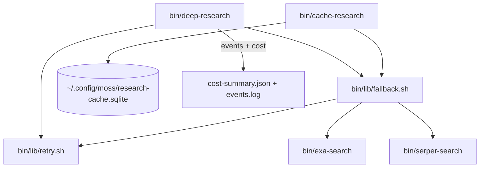

# Plan: Deep Research Reliability Layer (retry + fallback + cache)

## Goal

Add exponential-backoff retry, automatic Exa→Serper fallback, and SQLite result caching to `bin/deep-research` so the pipeline survives provider outages and avoids redundant API spend.

## Context

- **Workdir:** `/root/.openclaw/workspace`
- **Zone:** green (workspace + `bin/` + `skills/`)
- **Requester channel:** telegram (Alabama, 438805461)
- **Model (execute phase):** `grok-composer-2.5-fast` via `GROK_MODEL` env in `run-grok-task.sh`
- **Background:** Exa is currently in outage; Serper is live (2/2,500 queries used). Roadmap quick wins A/C in `skills/deep-research-test/AUTONOMY-ROADMAP.md` directly target this fragility.

### Related files (current state)

| File | Role |
|------|------|
| `bin/deep-research` | 369-line orchestrator; Stages 1/2/3/5/6; cost guard; direct `exa-search` + `serper-search` calls; one `curl` for synthesis |
| `bin/exa-search` | Exa API wrapper; exit 1 (no key/args), exit 2 (API error); outputs `.results[]` + `.costDollars.total` |
| `bin/serper-search` | Serper API wrapper; exit 2 on `.message` error; outputs `.organic[]` (no cost field) |
| `bin/tests/run-all-tests.sh` | Runs all `test-*.sh` via glob — new tests auto-included |
| `bin/tests/test-deep-research.sh` | Copies `deep-research` to temp dir with mock `exa-search`/`serper-search`; does **not** copy `lib/` (must update) |
| `~/.config/moss/secrets.env` | Both API keys (chmod 600) |
| `skills/deep-research-test/AUTONOMY-ROADMAP.md` | P0 reliability items |

### Gaps discovered during planning

1. **`bin/lib/` does not exist** — create directory + two new modules.
2. **`sqlite3` CLI not installed** — `libsqlite3` + Python `sqlite3` module present; install `sqlite3` package (`apt install sqlite3`) as execute-phase prerequisite, or use a thin `python3` helper inside `cache-research` (prefer CLI for bash consistency).
3. **Stage 2 runs Exa + Serper in parallel always** — fallback replaces only the Exa slot; separate Serper call remains (duplicate Serper on Exa-failure is acceptable for MVP; optional dedup noted below).
4. **`extract_cost` / jq paths assume raw Exa JSON** — wrapped output must retain `.costDollars.total` at top level for cost guard compatibility.
5. **`test-deep-research.sh` uses `SCRIPT_DIR`-relative paths** — copied script resolves mocks correctly, but `source "$SCRIPT_DIR/lib/..."` will fail unless `lib/` is copied or tests run from real `bin/`.

---

## Architecture



### Unified search result envelope

All `search_with_fallback` output written to workdir JSON files:

```json
{
  "provider": "exa",
  "results": [
    {"title": "...", "url": "https://...", "highlights": ["..."]}
  ],
  "costDollars": {"total": 0.007}
}
```

On Serper fallback, normalize `.organic[]` → `.results[]` (`link`→`url`, `snippet`→`highlights[0]`), set `provider: "serper"`, `costDollars.total: 0`.

---

## PR Plan (execution order)

### PR-1: `bin/lib/retry.sh` — exponential backoff wrapper

**Create** `bin/lib/retry.sh` (~80 lines).

#### API

```bash
retry_with_backoff <max_attempts> <initial_delay_sec> <command...>
# Defaults when called via helper: 3 attempts, 1s initial (1→2→4s)
```

#### Behavior

- Run `<command...>` in a subshell; capture combined stdout+stderr to temp file.
- **Success (exit 0):** print captured stdout, return 0.
- **Failure:** call `is_transient_failure <exit_code> <output>`:
  - **Transient (retry):** patterns in output (case-insensitive): `timeout`, `timed out`, `429`, `503`, `502`, `504`, `rate limit`, `too many requests`, `service unavailable`, `connection reset`, `connection refused` (for live outage)
  - **Transient (curl exit codes):** 28 (timeout), 7 (connection failed), 52 (empty reply)
  - **Permanent (no retry):** `401`, `403`, `400`, `invalid api key`, `unauthorized`, `forbidden`, `bad request`, plus exit 1 from missing-key wrappers
- Log to stderr: `⚠️ retry attempt N/M failed (exit CODE), retrying in DELAYs...`
- Sleep `delay`, double delay, repeat until max attempts.
- Return 1 if all attempts exhausted.

#### Design notes

- Pure bash (`set -euo pipefail` disabled inside function body to allow retry loop).
- Export function + `is_transient_failure` for reuse by `fallback.sh`.
- No `eval` — use `"$@"` after shifting max_attempts + delay.

---

### PR-2: `bin/lib/fallback.sh` — Exa → Serper fallback

**Create** `bin/lib/fallback.sh` (~120 lines).

#### API

```bash
search_with_fallback <query> <type> <num> <output_path>
# Returns: 0 on success (either provider), 1 if both fail
```

#### Behavior

1. Resolve bins (mirror `deep-research`):
   ```bash
   LIB_DIR="$(cd "$(dirname "${BASH_SOURCE[0]}")" && pwd)"
   BIN_DIR="$(dirname "$LIB_DIR")"
   EXA_CMD="${EXA_BIN:-$BIN_DIR/exa-search}"
   SERPER_CMD="${SERPER_BIN:-$BIN_DIR/serper-search}"
   ```
2. **Exa-eligible types:** `auto|fast|instant|deep-lite|deep|deep-reasoning` — try Exa first.
3. Run Exa via `retry_with_backoff 3 1` capturing to temp file:
   - Success + valid JSON with `.results` → wrap/add `provider: "exa"`, write to `<output_path>`, return 0.
   - Failure conditions triggering fallback:
     - Non-zero exit
     - Output contains 401/403/timeout/429 patterns (reuse `is_transient_failure` + auth patterns)
     - Empty/invalid JSON
4. **Fallback:** log `↪️ Exa failed for [type] query — falling back to Serper` to stderr.
5. Run `serper-search` via `retry_with_backoff 3 1`, normalize to envelope, write `<output_path>`, return 0.
6. If Serper also fails → return 1.

#### Helper: `wrap_exa_response(raw_json)`

- If response already has `provider` field, pass through.
- Else `jq` merge: `{provider: "exa", results: .results, costDollars: .costDollars}`.

#### Helper: `normalize_serper_response(raw_json)`

```bash
jq '{
  provider: "serper",
  results: [.organic[]? | {title, url: .link, highlights: [(.snippet // "")]}],
  costDollars: {total: 0}
}'
```

---

### PR-3: `bin/cache-research` — SQLite result cache

**Create** `bin/cache-research` (~150 lines, executable).

#### Prerequisite

```bash
sudo apt-get install -y sqlite3   # or verify already present
mkdir -p ~/.config/moss
```

#### Usage

```bash
bin/cache-research "query string" [--ttl=24h] [--type=auto] [--num=5]
bin/cache-research --clear          # DELETE FROM results WHERE expires_at < now
bin/cache-research --stats          # cache size, hit rate, cost saved
```

#### Schema (init on first run)

```sql
CREATE TABLE IF NOT EXISTS results (
  query_hash TEXT PRIMARY KEY,
  query TEXT NOT NULL,
  provider TEXT NOT NULL,
  type TEXT,
  num INTEGER,
  result_json TEXT NOT NULL,
  cost REAL DEFAULT 0,
  created_at INTEGER NOT NULL,
  expires_at INTEGER NOT NULL
);
CREATE INDEX IF NOT EXISTS idx_expires ON results(expires_at);

CREATE TABLE IF NOT EXISTS stats (
  key TEXT PRIMARY KEY,
  value INTEGER NOT NULL DEFAULT 0
);
-- keys: hits, misses, cost_saved (stored as integer micro-dollars or REAL)
```

#### Hash key

`query_hash = sha256("${query}|${type}|${num}")` via `printf '%s' "$key" | sha256sum | cut -d' ' -f1`.

#### TTL parsing

| Input | Seconds |
|-------|---------|
| `24h` (default) | 86400 |
| `1h` | 3600 |
| `2s` | 2 |
| `30m` | 1800 |

Regex: `^([0-9]+)(s|m|h|d)$`.

#### Flow

1. Parse args; if `--clear` / `--stats`, handle and exit.
2. Compute hash; `SELECT result_json, expires_at FROM results WHERE query_hash=?`.
3. **Cache hit** (row exists AND `expires_at > now`):
   - Increment `stats.hits`
   - `export CACHE_HIT=1` (and `echo "CACHE_HIT=1"` to stderr for visibility)
   - Print cached JSON to stdout, exit 0
4. **Cache miss:**
   - Increment `stats.misses`
   - `source bin/lib/fallback.sh`; call `search_with_fallback`
   - `INSERT OR REPLACE` row with result + cost + timestamps
   - Print JSON, exit 0

#### `--stats` output (stderr + stdout summary)

```
Cache entries: N (M expired pending --clear)
Hits: H | Misses: M | Hit rate: X%
Total cost saved: $Y.YY
```

Hit rate = `hits / (hits + misses) * 100` (guard div-by-zero).

---

### PR-4: Integrate into `bin/deep-research`

**Modify** `bin/deep-research` (~60 lines changed/added).

#### 4a. Bootstrap (after `SCRIPT_DIR` set, ~line 22)

```bash
source "$SCRIPT_DIR/lib/retry.sh"
source "$SCRIPT_DIR/lib/fallback.sh"
EVENTS_LOG="$WORKDIR/events.log"
touch "$EVENTS_LOG"
```

Move `EVENTS_LOG` init after `WORKDIR` mkdir (~line 68).

#### 4b. Event logging helper

```bash
log_event() {
  local event="$1" detail="$2"
  local ts
  ts=$(date -u +%Y-%m-%dT%H:%M:%SZ)
  printf '{"ts":"%s","event":"%s","detail":%s}\n' "$ts" "$event" "$detail" >> "$EVENTS_LOG"
}
```

#### 4c. Stage 2 — replace Exa calls (lines 146–149)

**Before:**
```bash
"$EXA_CMD" "$Q_QUERY" --type="$Q_TYPE" --num="$Q_NUM" > "$WORKDIR/exa-$i.json" 2>"$WORKDIR/exa-$i.log" &
```

**After:**
```bash
( search_with_fallback "$Q_QUERY" "$Q_TYPE" "$Q_NUM" "$WORKDIR/exa-$i.json" \
    2>"$WORKDIR/exa-$i.log" \
    || echo '{"provider":"none","results":[],"costDollars":{"total":0}}' > "$WORKDIR/exa-$i.json" ) &
```

Log fallback via parsing output file: if `jq -r '.provider' == "serper"` → `log_event "fallback" '{"stage":2,"provider":"serper",...}'`.

Keep parallel `$SERPER_CMD` call unchanged (dual coverage when Exa healthy).

#### 4d. Stage 3 — replace Exa calls (lines 191–192)

**Before:**
```bash
"$EXA_CMD" "$Q_QUERY" --type="$Q_TYPE" --num="$Q_NUM" > "$WORKDIR/stage3-$DEEP_IDX.json" 2>"$WORKDIR/stage3-$DEEP_IDX.log" || true
```

**After:**
```bash
if search_with_fallback "$Q_QUERY" "$Q_TYPE" "$Q_NUM" "$WORKDIR/stage3-$DEEP_IDX.json" \
    2>"$WORKDIR/stage3-$DEEP_IDX.log"; then
  prov=$(jq -r '.provider // "unknown"' "$WORKDIR/stage3-$DEEP_IDX.json")
  [ "$prov" = "serper" ] && log_event "fallback" "$(jq -n --arg q "$Q_QUERY" --argjson i "$i" '{stage:3,provider:"serper",query:$q,idx:$i}')"
else
  echo '{"provider":"none","results":[],"costDollars":{"total":0}}' > "$WORKDIR/stage3-$DEEP_IDX.json"
fi
```

#### 4e. Update `extract_cost` (line 74–78)

Already reads `.costDollars.total` — compatible with envelope format. No change needed.

#### 4f. Update `combined.txt` jq (lines 225–227, 245)

Works on `.results[]` — compatible if envelope used. Add provider annotation:

```bash
jq -r '"Provider: \(.provider // "exa")", (.results[]? | ...)' "$WORKDIR/exa-$i.json"
```

#### 4g. Stage 5 synthesis curl (line 281) — wrap with retry

```bash
SYNTH_RESPONSE=$(retry_with_backoff 3 1 curl -s -X POST "https://openrouter.ai/api/v1/chat/completions" \
  -H "Authorization: Bearer ${OPENROUTER_API_KEY}" \
  -H "Content-Type: application/json" \
  -d "$SYNTH_PAYLOAD")
```

On retry, `log_event "retry" '{"stage":5,"target":"openrouter"}'`.

#### 4h. Stage 6 Serper verification (line 310) — wrap with retry

```bash
SERP=$(retry_with_backoff 3 1 "$SERPER_CMD" "$KW" --num=5 2>/dev/null || echo '{}')
```

#### 4i. Extend `finalize_cost_summary` (lines 92–98)

```bash
finalize_cost_summary() {
  local events_json="[]"
  if [ -f "$EVENTS_LOG" ]; then
    events_json=$(jq -s '.' "$EVENTS_LOG" 2>/dev/null || echo '[]')
  fi
  jq -n \
    --argjson total "$TOTAL_COST" \
    --argjson budget "$BUDGET" \
    --argjson exceeded "$EXCEEDED" \
    --argjson events "$events_json" \
    '{total: $total, budget: $budget, exceeded: $exceeded, events: $events}' \
    > "$COST_SUMMARY" 2>/dev/null || true
}
```

#### 4j. Report header — surface provider info

In Stage 3 section of output markdown, include `provider` from each `stage3-*.json`. Enables smoke-test grep for `provider.*serper`.

#### Optional dedup (P2, skip unless trivial)

If `exa-$i.json` has `provider=serper`, skip redundant `serper-$i.json` fetch. Not required for MVP.

---

### PR-5: Test coverage

#### 5a. `bin/tests/test-retry.sh` (new)

| Case | Assert |
|------|--------|
| Mock cmd fails 2× then succeeds | exit 0, stderr shows attempts 1–2 |
| Mock cmd always fails transient | exit 1 after 3 attempts, delays logged |
| Mock cmd fails permanent (401) | exit 1 after 1 attempt (no retry) |
| Timing | total sleep ≥ 1+2=3s for 3-attempt transient (use `SECONDS` or `date +%s`) |

Mock failing command pattern:
```bash
ATTEMPT_FILE=/tmp/retry-count
# script reads/increments count, exits 1 until count>=3
```

Source real `bin/lib/retry.sh`.

#### 5b. `bin/tests/test-fallback.sh` (new)

| Case | Assert |
|------|--------|
| Mock Exa returns 401 | Serper mock called, output has `"provider":"serper"` |
| Mock Exa succeeds | `"provider":"exa"`, Serper mock NOT called |
| Return shape | `.results[0].url` present for both providers |
| Invalid EXA_API_KEY | Same as 401 case (use `MOCK_EXA_ERROR=1` or bad key) |

Setup: temp `TESTBIN/` with mock `exa-search` (exit 2 + error JSON), mock `serper-search`, copy `lib/fallback.sh` + `lib/retry.sh`, set `EXA_BIN`/`SERPER_BIN`.

Include sub-test matching verification spec:
```bash
EXA_API_KEY="invalid" bin/tests/test-fallback.sh
```

#### 5c. `bin/tests/test-cache.sh` (new)

| Case | Assert |
|------|--------|
| Write + read (TTL=60s) | Second call prints same JSON, `CACHE_HIT=1` in stderr |
| Expire (TTL=1s, sleep 2) | Third call is cache miss (no CACHE_HIT) |
| `--stats` | Shows ≥1 entry |
| `--clear` | Removes expired rows |

Use isolated cache file: `CACHE_DB="$TMP/test-cache.sqlite"` env var override in `cache-research` (add `CACHE_DB="${CACHE_DB:-$HOME/.config/moss/research-cache.sqlite}"` for testability).

#### 5d. Update `bin/tests/test-deep-research.sh`

Add before tests:
```bash
mkdir -p "$TESTBIN/lib"
cp "$ROOT_DIR/lib/retry.sh" "$ROOT_DIR/lib/fallback.sh" "$TESTBIN/lib/"
```

Verify existing 4 test cases still pass with real fallback layer (mocks remain compatible because `search_with_fallback` calls `$BIN_DIR/exa-search` which resolves to `TESTBIN/exa-search`).

#### 5e. `bin/tests/run-all-tests.sh`

No change needed — glob picks up `test-retry.sh`, `test-fallback.sh`, `test-cache.sh` automatically. Verify alphabetical order doesn't cause dependency issues (each test is independent).

---

## File manifest

| Action | Path | Est. size |
|--------|------|-----------|
| CREATE | `bin/lib/retry.sh` | ~80 lines |
| CREATE | `bin/lib/fallback.sh` | ~120 lines |
| CREATE | `bin/cache-research` | ~150 lines |
| MODIFY | `bin/deep-research` | ~60 lines delta |
| CREATE | `bin/tests/test-retry.sh` | ~80 lines |
| CREATE | `bin/tests/test-fallback.sh` | ~100 lines |
| CREATE | `bin/tests/test-cache.sh` | ~90 lines |
| MODIFY | `bin/tests/test-deep-research.sh` | ~5 lines (copy lib/) |

**Out of scope (unchanged):** `bin/exa-search`, `bin/serper-search`, `bin/exa-contents`, `bin/exa-research`, `bin/research-decompose` internals.

---

## Verification (execute phase)

```bash
cd /root/.openclaw/workspace

# 0. Prerequisite
sudo apt-get install -y sqlite3

# 1. Syntax check
bash -n bin/lib/retry.sh
bash -n bin/lib/fallback.sh
bash -n bin/cache-research
bash -n bin/deep-research
bash -n bin/tests/*.sh

# 2. Full test suite
bin/tests/run-all-tests.sh

# 3. Individual new tests
bin/tests/test-retry.sh
EXA_API_KEY="invalid" bin/tests/test-fallback.sh
bin/tests/test-cache.sh

# 4. Cache functional test
bin/cache-research "test query" --ttl=2s > /dev/null
sleep 3
bin/cache-research "test query" --ttl=2s > /dev/null   # re-fetch expected
bin/cache-research --stats

# 5. End-to-end smoke (Exa outage scenario)
eval "$(bin/load-secrets)"   # real Serper key
EXA_API_KEY="invalid" \
  bin/deep-research "What are the top MCP server platforms 2026?" \
  --depth=auto --budget=0.20 \
  --output=/tmp/deep-research-fallback-smoke.md

test -f /tmp/deep-research-fallback-smoke.md
grep -E "Stage 3|Stage 6|Total cost|provider.*serper|Provider: serper" /tmp/deep-research-fallback-smoke.md
```

**Expected:** all syntax checks pass; all tests PASS; smoke report contains Stage 3+6, cost header, and Serper provider markers; exit 0.

---

## Risks & mitigations

| Risk | Mitigation |
|------|------------|
| `test-deep-research` breaks on missing `lib/` | Copy `lib/` in test setup (PR-5d) |
| Duplicate Serper calls on fallback | Accept for MVP; optional dedup later |
| `sqlite3` not installed | apt install in execute step 0 |
| `retry_with_backoff` + `set -e` in caller | Subshell-wrap calls where failure is tolerated (`|| true` / fallback JSON) |
| Serper can't do `deep-reasoning` | Fallback degrades gracefully — log warning in stderr; better than pipeline crash |
| Cost guard double-counting | `extract_cost` only on envelope `.costDollars.total`; Serper=0 |

---

## Estimated effort

| PR | Time |
|----|------|
| PR-1 retry.sh | 30 min |
| PR-2 fallback.sh | 45 min |
| PR-3 cache-research | 45 min |
| PR-4 deep-research integration | 45 min |
| PR-5 tests + fixes | 45 min |
| Verification + smoke | 15 min |
| **Total** | **~3.5 h** |

---

## Rules (planning phase)

- ✅ PLANNING ONLY complete — this file is the deliverable.
- ❌ No source files modified during planning.
- ⏸ STOP here — await execute approval (ja/kör/ok) before implementation.